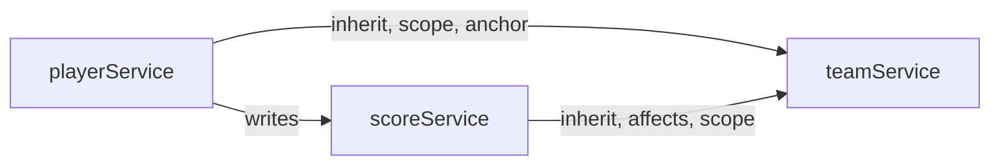

<!-- Generated by quickdraw-docs from the app's contracts. Do not edit: change the contract and run quickdraw-docs again. -->

# API reference

One page per service, generated from its contract by `quickdraw-docs`.

| Service                           | Methods | Collections | Streams | Channels | Events |
| --------------------------------- | ------- | ----------- | ------- | -------- | ------ |
| [noteService](noteService.md)     | 1       | 0           | 0       | 0        | 0      |
| [playerService](playerService.md) | 2       | 2           | 0       | 0        | 0      |
| [scoreService](scoreService.md)   | 1       | 0           | 1       | 0        | 0      |
| [teamService](teamService.md)     | 7       | 0           | 3       | 1        | 0      |

## Dependencies

An arrow points from a service to another its declarations name: `inherit` (its row policy), `writes` (that service's model), `affects`, `scope` (a `{ scope, of }` access form) or `anchor` (a collection's anchor). Each service's page lists them.

